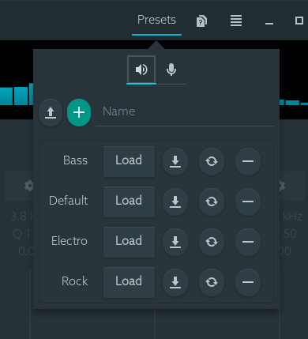

# EasyEffects Presets

A [Polybar](https://github.com/polybar/polybar) module to control [EasyEffects](https://github.com/wwmm/easyeffects) with presets. Main features:

* Switch between presets with a single click.
* Works both for output and input presets.
* Reset EasyEffects easily.
* Highly customizable: check the [Usage](#usage) section for details.


## Installation

### Arch

Install [`easyeffects-presets`](https://aur.archlinux.org/packages/easyeffects-presets/) from the AUR with your preferred method, for example:

```
$ yay -S easyeffects-presets
```

### Other Linux

Download the [bash script](https://github.com/marioortizmanero/polybar-easyeffects-presets/blob/master/easyeffects-presets.bash) from this repository, or extract it from [the latest release](https://github.com/marioortizmanero/polybar-easyeffects-presets/releases/latest), and put it somewhere in your `$PATH`.

#### Dependencies

The only dependency is [`easyeffects`](https://github.com/wwmm/easyeffects). The script is intended to be used with Polybar but it can be easily adapted to work with other status bars. If you get it working somewhere else let us know to update this README!

At a minimum, bash version 4.2 is required to run the script. You can check your bash version by running `bash --version`.

You'll need a few presets set up for this module. You can do that inside the app by configuring some filters (e.g. the Equalizer) and saving them in the "Presets" tab:



## Usage

`easyeffects-presets` is expected to be invoked from a [polybar](//github.com/polybar/polybar) module:

```ini
[module/pulseffects-presets]
type = custom/script
exec = easyeffects-presets [option...] <action>
```

where `action`, and (optionally) `option`s are as specified in `pulseffects-presets help`:

```
Usage: ./easyeffects-presets [OPTIONS...] ACTION

Options:
  --format <string>
        Use a format string to control the output.
        Available variables:
        * $PRESET
        * $POSITION
        * $TOTAL
        Default: $PRESET
  --save-file <string>
        The script's save file's location for persistent data.
        Default: /home/mario/.config/easyeffects_preset
  --no-preset-name <string>
        What name to use when no preset is set.
        Default: None
  --output,
  --input
        Whether to use output or input presets in this script
        Defaut: Output

Actions:
  help   display this message and exit
  show   print the EasyEffects status once
  next   switch to the next EasyEffects status available
  prev   switch to the previous EasyEffects status available
  reset  restore this script and EasyEffects to their initial states
```

See the [Module](#module) section for an example, or the [Useful icons](#useful-icons) section for some packs of icons.

## Module

The example from the screenshot can:

* Switch to the previous preset on left click
* Switch to the next preset on right click
* Reset the script and EasyEffects on mousewheel click
* Update when the preset is changed with EasyEffects directly

If you want to apply both input and output presets, you can create two modules, one using `--output` and another with `--input`.

```ini
[bar/status_bar]
modules-left   =
modules-center =
modules-right  = easyeffects-presets easyeffects-presets-ipc
# IPC is required so that the output is instantly refreshed when performing an
# action. Thus, `enable-ipc` must be set to `true` in your bar's config. It's a
# workaround until https://github.com/polybar/polybar/issues/786 is fixed.
enable-ipc = true

[module/easyeffects-presets]
type = custom/script
exec = polybar-msg hook easyeffects-presets-ipc 1 &>/dev/null
# You may want to tweak this for faster updates from EasyEffects
interval = 60

# Uses IPC to update the output on click
[module/easyeffects-presets-ipc]
type = custom/ipc
hook-0 = easyeffects-presets --format '  $PRESET [$POSITION/$TOTAL]' show
# The command shouldn't be ran once for each bar, so `next` and `reset` are
# executed here and then the output is updated via IPC.
click-left   = easyeffects-presets prev  && polybar-msg hook easyeffects-presets-ipc 1
click-right  = easyeffects-presets next  && polybar-msg hook easyeffects-presets-ipc 1
click-middle = easyeffects-presets reset && polybar-msg hook easyeffects-presets-ipc 1
```

Or if you don't care about preset updates from the EasyEffects app, you can use this simpler one, which will only update when it's interacted with:

```ini
# Uses IPC to update the output on click
[module/easyeffects-presets-ipc]
type = custom/ipc
initial = 1
hook-0 = easyeffects-presets --format '  $PRESET [$POSITION/$TOTAL]' show
# The command shouldn't be ran once for each bar, so `next` and `reset` are
# executed here and then the output is updated via IPC.
click-left   = easyeffects-presets prev  && polybar-msg hook easyeffects-presets-ipc 1
click-right  = easyeffects-presets next  && polybar-msg hook easyeffects-presets-ipc 1
click-middle = easyeffects-presets reset && polybar-msg hook easyeffects-presets-ipc 1
```

*Note: the `easyeffects-presets` script may be saved somewhere else and pointed at with the full path instead of by adding it to the `$PATH`*

## Useful icons

Here's a list with icons you can copy-paste to customize the module with `--format`.

| Font name                                       | Icon     |
| ----------------------------------------------- | :------: |
| [FontAwesome](https://fontawesome.com)          | ``      |
| [Material](https://material.io/resources/icons) | ``, `` |
| Emoji                                           | `🎛️`, `🎚️` |

## Sources

This script is based on [polybar-pulseaudio-control](https://github.com/marioortizmanero/polybar-pulseaudio-control), another module to control PulseAudio in a similar dynamic. Go check it out if you like this module :)
