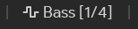

# PulseEffects Presets

A [Polybar](https://github.com/polybar/polybar) module to control [PulseEffects](https://github.com/wwmm/pulseeffects) with presets. Main features:

* Switch between presets with a single click.
* Works both for output and input presets.
* Reset PulseEffects easily.
* Highly customizable: check the [Usage](#usage) section for details.



## Installation

Download the [bash script](https://github.com/marioortizmanero/polybar-pulseeffects-presets/blob/master/polybar-pulseeffects-presets.bash) from this repository, or extract it from [the latest release](https://github.com/marioortizmanero/polybar-pulseeffects-presets/releases/latest), and put it somewhere in your `$PATH`.

#### Dependencies

The only dependency is [`pulseeffects`](https://github.com/wwmm/pulseeffects). The script is intended to be used with Polybar but it can be easily adapted to work with other status bars. If you get it working somewhere else let us know to update this README!

At a minimum, bash version 4.2 is required to run the script. You can check your bash version by running `bash --version`.

You'll need a few presets set up for this module. You can do that inside the app by configuring some filters (e.g. the Equalizer) and saving them in the "Presets" tab:


## Usage

`pulseeffects-presets` is expected to be invoked from a [polybar](//github.com/polybar/polybar) module:

```ini
[module/pulseffects-presets]
type = custom/script
exec = pulseeffects-presets.bash [option...] <action>
```

where `action`, and (optionally) `option`s are as specified in `pulseffects-presets help`:

```
Usage: ./pulseeffects-presets.bash [OPTIONS...] ACTION

Options: [defaults]
  --format <string>            use a format string to control the output
                               Available variables: $PRESET [$PRESET]
  --config <string>            the script save file's location [~/.config/pulseeffects_preset]
  --no-preset-name <string>    what name to use when no preset is set
                               [None]
  --output                     whether to use output or input presets in this
  --input                      script [Output]

Actions:
  help   display this message and exit
  show   print the PulseEffects status once
  next   switch to the next PulseEffects status available
  reset  restore this script and PulseEffects to their initial states
```

See the [Module](#module) section for an example, or the [Useful icons](#useful-icons) section for some packs of icons.

## Module

The example from the screenshot can:

* Switch to the next preset on left click
* Reset the script and PulseEffects on right click


If you want to apply both input and output presets, you can create two modules, one using `--output` and another with `--input`.

```ini
[bar/status_bar]
modules-left   =
modules-center =
modules-right  = pulseeffects-presets pulseeffects-presets-ipc
# IPC is required so that the output is instantly refreshed when performing an
# action. Thus, `enable-ipc` must be set to `true` in your bar's config. It's a
# workaround until https://github.com/polybar/polybar/issues/786 is fixed.
enable-ipc = true

[module/pulseeffects-presets]
type = custom/script
exec = polybar-msg hook pulseeffects-presets-ipc 1 &>/dev/null
interval = 60

# Uses IPC to update the output on click
[module/pulseeffects-presets-ipc]
type = custom/ipc
hook-0 = pulseeffects-presets.bash --format '  $PRESET' show
# The command shouldn't be ran once for each bar, so `next` and `reset` are
# executed here and then the output is updated via IPC.
click-left  = pulseeffects-presets.bash next && polybar-msg hook pulseeffects-presets-ipc 1
click-right  = pulseeffects-presets.bash reset && polybar-msg hook pulseeffects-presets-ipc 1
```

*Note: the `pulseeffects-presets.bash` may be saved somewhere else and pointed at with the full path instead of by adding it to the `$PATH`*

## Useful icons

Here's a list with icons you can copy-paste to customize the module with `--format`.

| Font name                                       | Icon     |
| ----------------------------------------------- | :------: |
| [FontAwesome](https://fontawesome.com)          | ``      |
| [Material](https://material.io/resources/icons) | ``, `` |
| Emoji                                           | `🎛️`, `🎚️` |

## Sources

This script is based on [polybar-pulseaudio-control](https://github.com/marioortizmanero/polybar-pulseaudio-control), another module to control PulseAudio in a similar dynamic. Go check it out if you like this module :)
